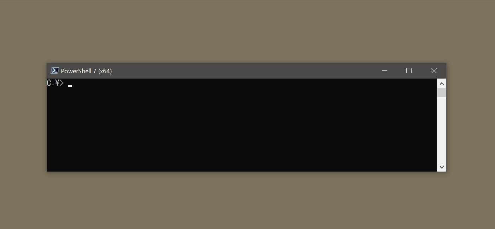

# PSCoreUpdate


New cross-platform PowerShell update tool.

## Motivation

PSCoreUpdate supports automation update of new cross-platform PowerShell (pwsh).  

Currently, PowerShell Team is planning on supporting security updates of PowerShell through Microsoft Update on Windows ([#6118](https://github.com/PowerShell/PowerShell/issues/6118)), but it will take some time for realization.  
[Homebrew Cask](https://caskroom.github.io/) is now available on macOS, but the installation of Homebrew is a bit heavy.  

This module is a little tool to solve such inconvenience.

## How to install

You can install it from [PowerShell gallery](https://www.powershellgallery.com/packages/PSCoreUpdate).

```powershell
Install-Module PSCoreUpdate
```

### Upgrade from version 2

If you use PSCoreUpdate version 2 or earlier, please uninstall all version first.

```powershell
Uninstall-Module PSCoreUpdate -AllVersions
Install-Module PSCoreUpdate
```

Note : PSCoreUpdate version.3 has many breaking changes.

* See the [release note](https://github.com/stknohg/PSCoreUpdate/releases/tag/v3.0.0) for detail.

### First-time installation

This module is for updating PowerShell.  
So, the first-time installation must be performed manually.

You can use the [official installation script](https://github.com/PowerShell/PowerShell/blob/master/tools/install-powershell.ps1-README.md).

```powershell
Invoke-Expression "& { $(Invoke-RestMethod 'https://aka.ms/install-powershell.ps1') } -UseMSI -Quiet"
```

## Usage

### Test-LatestVersion

Check if the current console is the latest version.

```powershell
PS C:\> Test-LatestVersion
No updates. PowerShell 7.2.6 is the latest version.
```

If you use preview release PowerShell, you can use `-Release Preview` parameter.

```powershell
PS C:\> Test-LatestVersion -Release Preview
```

if you use LTS version PowerShell, you can can use `-Release LTS` parameter.

```powershell
PS C:\> Test-LatestVersion -Release LTS
```

### Update-PowerShellRelease

Update PowerShell if the newer version found.   

```powershell
PS C:\> Update-PowerShellRelease -Latest
```



If you want to update preview release, you can use `-Release Preview` parameter.

```powershell
PS C:\> Update-PowerShellRelease -Latest -Release Preview
```

if you use LTS version PowerShell, you can can use `-Release LTS` parameter.

```powershell
PS C:\> Update-PowerShellRelease -Latest -Release LTS
```

You can do silent install with `-Silent` switch parameter.

```powershell
PS C:\> Update-PowerShellRelease -Latest -Silent
```

* This cmdlet supports only Windows and macOS.  
  You can use a package management tool like yum, apt etc. on Linux.

### Find-PowerShellRelease

Find PowerShell release information from GitHub.

```powershell
PS C:\> Find-PowerShellRelease -MaxItems 10

Version Name                         Published             PreRelease
------- ----                         ---------             ----------
7.2.6   v7.2.6 Release of PowerShell 8/11/2022 10:18:36 PM False
7.2.5   v7.2.5 Release of PowerShell 6/21/2022 6:34:22 PM  False
7.2.4   v7.2.4 Release of PowerShell 5/17/2022 6:03:36 PM  False
7.2.3   v7.2.3 Release of PowerShell 4/26/2022 11:21:03 PM False
7.2.2   v7.2.2 Release of PowerShell 3/16/2022 7:34:38 PM  False
7.2.1   v7.2.1 Release of PowerShell 12/14/2021 6:15:04 PM False
7.2.0   v7.2.0 Release of PowerShell 11/8/2021 4:10:35 PM  False
7.1.7   v7.1.7 Release of PowerShell 4/26/2022 11:20:43 PM False
7.1.6   v7.1.6 Release of PowerShell 3/16/2022 7:34:17 PM  False
7.1.5   v7.1.5 Release of PowerShell 10/14/2021 6:21:02 PM False
```

#### New features from version.3

`Find-PowerShellRelease` stores local in-memory cache for 10 minutes.  
If you don't want use cache, use `-NoCache` parameter.

```powershell
Find-PowerShellRelease -MaxItems 10 -NoCache
```

`-VersionRange` parameter is added instead of `-MinimumVersion`, `-MaximumVersion`.  
This parameter follows [Nuget version range](https://docs.microsoft.com/en-us/nuget/concepts/package-versioning#version-ranges) syntax.

```powershell
PS C:\> Find-PowerShellRelease -VersionRange "[7,7.1]"

Version Name                          Published             PreRelease
------- ----                          ---------             ----------
7.1.0   v7.1.0 Release of PowerShell  11/11/2020 4:23:08 PM False
7.0.12  v7.0.12 Release of PowerShell 8/11/2022 10:15:19 PM False
7.0.11  v7.0.11 Release of PowerShell 5/17/2022 5:14:54 PM  False
7.0.10  v7.0.10 Release of PowerShell 4/26/2022 11:20:14 PM False
7.0.9   v7.0.9 Release of PowerShell  3/16/2022 7:33:49 PM  False
7.0.8   v7.0.8 Release of PowerShell  10/14/2021 6:20:42 PM False
7.0.7   v7.0.7 Release of PowerShell  8/12/2021 10:19:04 PM False
7.0.6   v7.0.6 Release of PowerShell  3/11/2021 11:26:32 PM False
7.0.5   v7.0.5 Release of PowerShell  2/11/2021 11:48:30 PM False
7.0.4   v7.0.4 Release of PowerShell  1/19/2021 10:22:06 PM False
7.0.3   v7.0.3 Release of PowerShell  7/16/2020 6:23:52 PM  False
7.0.2   v7.0.2 Release of Powershell  6/11/2020 9:02:14 PM  False
7.0.1   v7.0.1 Release of PowerShell  5/14/2020 10:52:22 PM False
7.0.0   v7.0.0 Release of PowerShell  3/4/2020 5:00:08 PM   False
```

### Find-PowerShellBuildStatus

Find PowerShell build status.

```powershell
PS C:\> Find-PowerShellBuildStatus -All

Version         Release ReleaseDate
-------         ------- -----------
7.2.6           Stable  8/11/2022 11:09:53 PM
7.3.0-preview.8 Preview 9/20/2022 8:29:39 PM
7.2.6           LTS     8/11/2022 11:09:53 PM
```

### Save-PowerShellAsset

Download PowerShell release assets.

```powershell
PS C:\> Save-PowerShellAsset -Latest -AssetType MSI_WIN64 -OutDirectory .\
```

The types of assets are as follows.

|Value|Asset|
|----|----|
|HASHES_SHA256|hashes.sha256|
|MSI_WIN32|[PowerShell version]-win-x86.msi|
|MSI_WIN64|[PowerShell version]-win-x64.msi|
|MSIXBUNDLE|[PowerShell version]-win.msixbundle|
|PKG_OSX|[PowerShell version]-osx-x64.pkg|
|PKG_OSXARM64|[PowerShell version]-osx-arm64.pkg|
|RPM_CM|[PowerShell version]-cm.x86_64.rpm|
|RPM_RH|[PowerShell version]-rh.x86_64.rpm|
|DEB_DEB64|[PowerShell version]-deb_amd64.deb|
|TAR_LINUXARM32|[PowerShell version]-linux-arm32.tar.gz|
|TAR_LINUXARM64|[PowerShell version]-linux-arm64.tar.gz|
|TAR_LINUXALPINE64|[PowerShell version]-linux-alpine-x64.tar.gz|
|TAR_LINUX64FXDEPENDENT|[PowerShell version]-linux-x64-fxdependent.tar.gz|
|TAR_LINUX64|[PowerShell version]-linux-x64.tar.gz|
|TAR_OSX|[PowerShell version]-osx-x64.tar.gz|
|TAR_OSXARM64|[PowerShell version]-osx-arm64.tar.gz|
|ZIP_WINARM32|[PowerShell version]-win-arm32.zip|
|ZIP_WINARM64|[PowerShell version]-win-arm64.zip|
|ZIP_WIN32|[PowerShell version]-win-x86.zip|
|ZIP_WIN64|[PowerShell version]-win-x64.zip|
|ZIP_WINFXDEPENDENT|[PowerShell version]-win-fxdependent.zip|
|ZIP_WINFXDEPENDENTDESKTOP|[PowerShell version]-win-fxdependentWinDesktop.zip|

#### Old release assets

* These assets are not available from the latest version.

|Value|Asset|
|----|----|
|MSIX_WIN32|[PowerShell version]-win-x86.msix (Currently unreleased [#13284](https://github.com/PowerShell/PowerShell/issues/13284))|
|MSIX_WIN64|[PowerShell version]-win-x64.msix (Currently unreleased [#13284](https://github.com/PowerShell/PowerShell/issues/13284))|
|MSIX_WINARM32|[PowerShell version]-win-arm32.msix (Currently unreleased [#13284](https://github.com/PowerShell/PowerShell/issues/13284))|
|MSIX_WINARM64|[PowerShell version]-win-arm64.msix (Currently unreleased [#13284](https://github.com/PowerShell/PowerShell/issues/13284))|
|PKG_OSX1011|[PowerShell version]-osx.10.11-x64.pkg|
|PKG_OSX1012|[PowerShell version]-osx.10.12-x64.pkg|
|RPM_RHEL8|[PowerShell version]-centos.8.x86_64.rpm|
|RPM_RHEL7|[PowerShell version]-rhel.7.x86_64.rpm|
|DEB_DEBIAN8|[PowerShell version]-debian.8_amd64.deb|
|DEB_DEBIAN9|[PowerShell version]-debian.9_amd64.deb|
|DEB_DEBIAN10|[PowerShell version]-debian.10_amd64.deb|
|DEB_DEBIAN11|[PowerShell version]-debian.11_amd64.deb|
|DEB_UBUNTU14|[PowerShell version]-ubuntu.14.nn_amd64.deb|
|DEB_UBUNTU16|[PowerShell version]-ubuntu.16.nn_amd64.deb|
|DEB_UBUNTU17|[PowerShell version]-ubuntu.17.nn_amd64.deb|
|DEB_UBUNTU18|[PowerShell version]-ubuntu.18.nn_amd64.deb|
|DEB_UBUNTU20|[PowerShell version]-ubuntu.20.nn_amd64.deb|
|APPIMAGE|[PowerShell version]-x86_64.AppImage|
|WIXPDB32|[PowerShell version]-win-x86.wixpdb|
|WIXPDB64|[PowerShell version]-win-x64.wixpdb|
